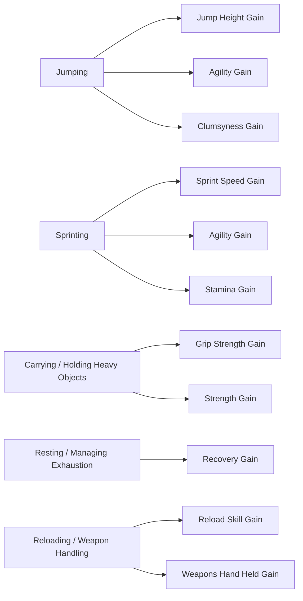
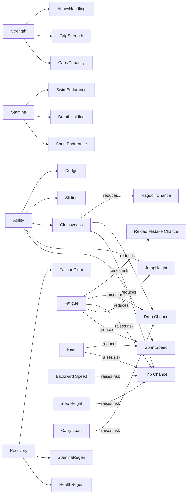
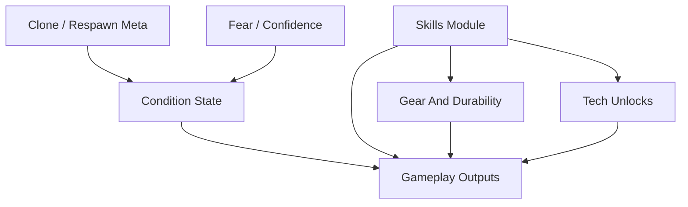
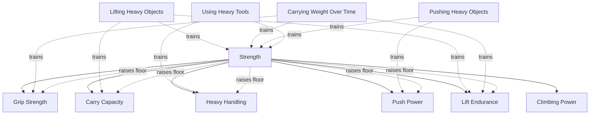

# Skills Visual Map

This file is the working visual for the planned hierarchical skill system.

Use it for:
- seeing parent -> child relationships
- seeing how actions train skills
- seeing how skills influence floors and final gameplay outputs
- spotting circular dependencies before they become implementation problems

Do not use this file as the exact balance sheet.
Use `SKILLS_TUNING_MATRIX.csv` for tuning numbers, curves, and per-link notes.

## Scale

- General skill authoring target: human-readable `0.0` to `100.0`
- Planned runtime storage target: scaled integers
- `Clumsyness` clarification:
  - `0` = most clumsy
  - `100` = least clumsy
  - higher `Clumsyness` skill means lower trip / fumble / ragdoll risk

## Rule Of Thumb

Prefer this direction of influence:

`Action -> Child Skill Gain -> Parent Skill Gain -> Child Skill Floor -> Final Output`

Avoid doing this live every frame:

`Child Skill -> Parent Skill -> Same Child Skill -> Same Parent Skill`

The child can train the parent through earned progression events.
The parent can raise the child's floor at runtime.

## Hierarchy View

```mermaid
flowchart TD
    Core[Base Skills]

    Strength[Strength]
    Stamina[Stamina]
    Agility[Agility]
    Recovery[Recovery]

    Core --> Strength
    Core --> Stamina
    Core --> Agility
    Core --> Recovery

    Strength --> GripStrength[Grip Strength]
    Strength --> CarryCapacity[Carry Capacity]
    Strength --> HeavyHandling[Heavy Handling]

    Stamina --> SprintEndurance[Sprint Endurance]
    Stamina --> BreathHolding[Breath Holding]
    Stamina --> SwimEndurance[Swim Endurance]

    Agility --> WalkSpeed[Walk Speed]
    Agility --> SprintSpeed[Sprint Speed]
    Agility --> JumpHeight[Jump Height]
    Agility --> Dodge[Dodge / Side Step / Roll]
    Agility --> Sliding[Sliding]
    Agility --> Clumsyness[Clumsyness]

    Recovery --> HealthRegen[Health Regen]
    Recovery --> StaminaRegen[Stamina Regen]
    Recovery --> FatigueClear[Fatigue Clear Rate]
```

## Skill Tree Draft

```mermaid
flowchart TD
    Player[Main Character]

    Player --> Strength[Strength]
    Player --> Stamina[Stamina]
    Player --> Agility[Agility]
    Player --> Recovery[Recovery]

    Strength --> GripStrength[Grip Strength]
    Strength --> CarryCapacity[Carry Capacity]
    Strength --> HeavyHandling[Heavy Weapon Handling]
    Strength --> ClimbingPower[Climbing Power]

    Stamina --> SprintEndurance[Sprint Endurance]
    Stamina --> BreathHolding[Breath Holding]
    Stamina --> SwimEndurance[Swim Endurance]
    Stamina --> WorkCapacity[Work Capacity]

    Agility --> WalkSpeed[Walk Speed]
    Agility --> SprintSpeed[Sprint Speed]
    Agility --> JumpHeight[Jump Height]
    Agility --> Dodge[Dodge]
    Agility --> SideStep[Side Step]
    Agility --> Roll[Roll]
    Agility --> Sliding[Sliding]
    Agility --> Clumsyness[Clumsyness]

    Recovery --> HealthRegen[Health Regen]
    Recovery --> StaminaRegen[Stamina Regen]
    Recovery --> FatigueClear[Fatigue Clear Rate]
    Recovery --> InjuryRecovery[Injury Recovery]

    Jumping[Jumping Often] -. trains .-> JumpHeight
    Jumping -. trains .-> Agility
    Jumping -. trains .-> Clumsyness

    Sprinting[Sprinting Often] -. trains .-> SprintSpeed
    Sprinting -. trains .-> Agility
    Sprinting -. trains .-> Stamina

    Carrying[Carrying Heavy Objects] -. trains .-> GripStrength
    Carrying -. trains .-> Strength

    Resting[Recovering Well] -. trains .-> Recovery

    Agility -. raises floor .-> SprintSpeed
    Agility -. raises floor .-> JumpHeight
    Agility -. raises floor .-> Clumsyness

    Strength -. raises floor .-> GripStrength
    Strength -. raises floor .-> CarryCapacity

    Stamina -. raises floor .-> SprintEndurance
    Recovery -. raises floor .-> FatigueClear
```

## Training View

## Influence View

Positive arrows mean "raises floor / improves output."
Negative arrows mean "raises risk / worsens output."

## System Layer View

Not every progression idea should live inside the skills module.

## First Pass Recommendation

Start by fully mapping only these:
- `Strength`
- `Stamina`
- `Agility`
- `Recovery`
- `JumpHeight`
- `SprintSpeed`
- `Clumsyness`

And only these live outputs:
- jump result
- sprint speed
- trip chance
- drop chance
- pickup / carry feel

If that slice feels good, add:
- sliding
- dodge / roll
- heavy weapon handling
- breath holding / swimming
- regen
- fear / confidence
- glasses and drone tech integration

## Strength Branch Draft

Use this as the first detailed branch workshop.

### Parent Skill

- `Strength`

### Things That Can Train Strength

- lifting and holding heavy physics objects
- carrying heavy objects over time
- pushing against heavy objects
- dragging heavy objects
- moving while overburdened
- using heavy melee tools or weapons
- sustained climbing / hanging effort

### Strength Child Skills

- `GripStrength`
  - how well the actor keeps hold of objects or weapons
- `CarryCapacity`
  - how much load can be comfortably lifted or carried
- `HeavyHandling`
  - how stable heavy tools and weapons feel in the hands
- `PushPower`
  - how much force the actor can transfer into world objects
- `LiftEndurance`
  - how long heavy lifting can be sustained before forced drop or severe stamina drain
- `ClimbingPower`
  - how much upper-body force can be applied to climbing actions

### Strength Direct Outputs

- pickup / hold force
- max comfortable carry weight
- how long a held object can be maintained
- stamina drain while lifting or carrying
- push / shove / bump force into physics objects
- ability to move heavier world objects by collision or body pressure
- heavy melee swing control
- heavy weapon handling stability
- drag force on heavy objects
- trolley push effectiveness
- drone lift-assist target tuning if the drone inherits or references a strength profile

### Things Strength Can Raise The Minimum Of

- `GripStrength`
- `CarryCapacity`
- `HeavyHandling`
- `PushPower`
- `LiftEndurance`
- optionally a small baseline for `ClimbingPower`

### Things That Affect Final Strength Performance

- `Strength` level
- `GripStrength`
- `CarryCapacity`
- `LiftEndurance`
- current `Stamina`
- `Fatigue`
- `Exhaustion`
- carried load weight
- awkward leverage / off-center hold
- injury state
- fear / panic state if that system is active
- clone defects or mutation modifiers
- equipment assists such as straps, harnesses, braces, powered gear

### Candidate Strength Flow

### Good First Strength Slice

If we implement only the most useful first outputs, start here:
- pickup hold force
- carry duration
- stamina drain while holding heavy objects
- push force against physics objects
- trolley push / movement effectiveness

Everything else can branch from that later.
